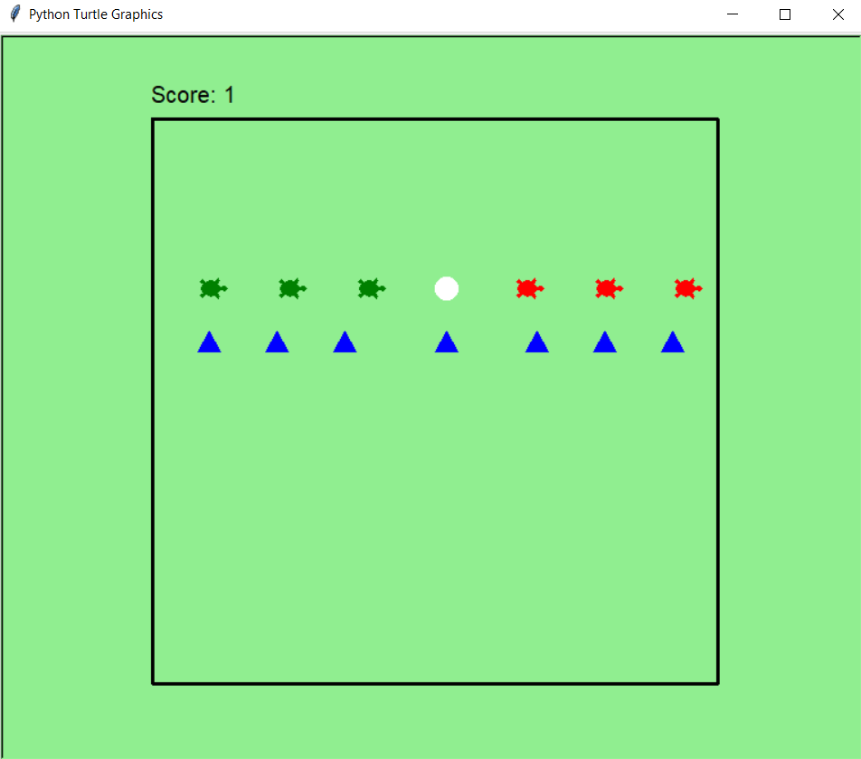
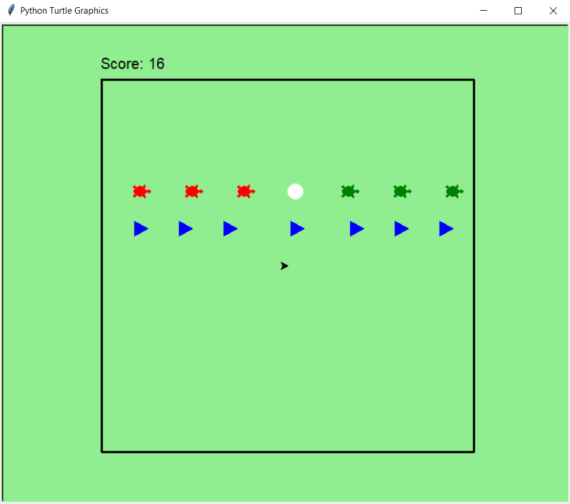

# Frog Puzzle Game
Solving a game problem with Artificial Intelligence 'AI'.

 

## Table of contents
* [General info](#general-info)
* [Technologies](#technologies)
* [Launch](#launch)
* [Setup](#setup)
* [Example of use](#example-of-use)

 
 

## General info
Teaching the computer to do some steps to solve the problem of the frog puzzle game without human intervention by applying A* algorithm technique.

 

## Technologies
Project is created with:
* Python 3
* Turtle graphics : to create GUI with some animations

 

## Launch
1. open lib folder
2. run [main.py](lib/main.py)

 

## Setup
To run this project, install [Python 3](https://www.python.org/downloads/ "Python 3 download page") and by default turtle graphics package is included inside python.

 

## Example of use
| First Score | Final Score |
| ----------- | ----------- |
|   |  |
| In first score, we need to swap between green and red frogs. | So, after sixteen steps Congratulations green and red  frogs has been swapped. |
